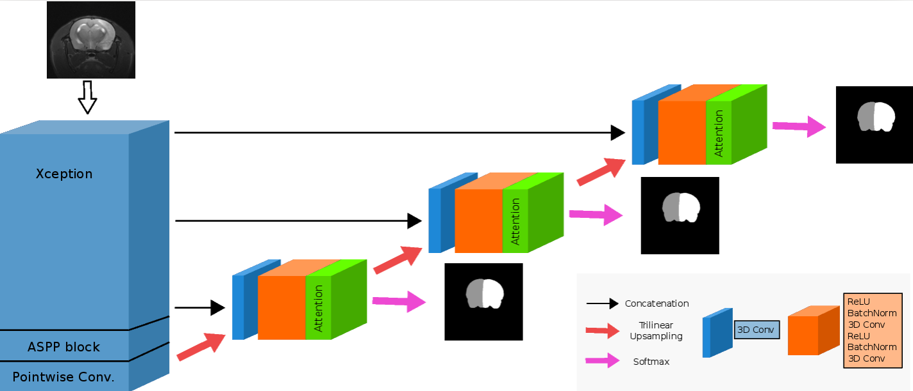

MedicDeepLabv3+
======================

Repository of MedicDeepLabv3+



### Table of Contents
* [1. Introduction](#1-introduction)
  * [1.1. Files](#11-files)
* [2. Installation and Requirements](#2-installation-and-requirements)
  * [2.1. Requirements](#21-requirements)
  * [2.2. Installation](#22-installation)
  * [2.3. Image format](#23-image-format)
  * [2.4. Setup](#24-setup)
* [3. Training and Evaluation](#3-training-and-evaluation)
  * [3.1. Training](#31-training)
  * [3.2. Evaluation](#32-evaluation)
* [4. License](#4-license)
* [5. Contact](#5-contact)

### 1. Introduction
MedicDeepLabv3+ is a convolutional neural network based on DeepLabv3+ implemented in Python and Pytorch to extract the brain mask and the contralateral hemisphere of rodent MRI brain scans with lesions. The code of MedicDeepLabv3+ is simplified to make it readable and accessible to a wide audience.

This implementation of MedicDeepLabv3+ allows combining several models trained separately. This script will generate a prediction per model and, if multiple trained models are provided, it will produce a segmentations combined with majority voting across each model prediction. Post-processing, i.e. removing small independently connected components (holes and islands) is also available and is activated by default.

#### 1.1 Files

```cshell
.
 ├── eval.py # Generates segmentation masks. It requires a file with the trained parameters of MedicDeepLabv3+ (provided by train.py)
 ├── train.py # Optimizes MedicDeepLabv3+ and saves its optimized parameters (required by eval.py)
 ├── lib
 │   ├── losses.py # Cross Entropy + Dice Loss functions
 │   ├── metric.py # Metrics to quantify segmentations quality i.e. Dice coeff., Hausdorff distance, Compactness
 │   ├── utils.py # Other functions.
 │   ├── blocks
 │   │   ├── BasicBlocks.py # Contains basic operations of the ConvNet
 │   │   └── MedicDeepLabv3PlusBlocks.py # Blocks of operations for MedicDeepLabv3+
 │   ├── data
 │   │   ├── BaseDataset.py # Basic dataset operations
 │   │   └── DataWrapper.py # Reads and parses the NIfTI files
 │   └── models
 │      ├── BaseModel.py # Contains main training and evaluation procedures
 │      └── MedicDeepLabv3Plus.py # Pytorch definition of our model
 └── trained_models # Trained MedicDeepLabv3+ parameters
     ├── MedicDeepLabv3Plus-model-300_1
     ├── MedicDeepLabv3Plus-model-300_2
     └── MedicDeepLabv3Plus-model-300_3
```

### 2. Installation and Requirements

#### 2.1 Requirements
 * [Python](https://www.python.org/downloads/) (preferably version 3). Programming language of MedicDeepLabv3+.
 * [PyTorch](https://pytorch.org/get-started/locally/) (preferably with GPU support). Deep Learning framework.
 * [pip](https://pypi.org/project/pip/). Python package installer.
 * [Virtual Enviroment](https://packaging.python.org/guides/installing-using-pip-and-virtual-environments/) (optional)

#### 2.2 Installation

0. Install all libraries from 2.1 Requirements

1. Install dependencies with pip
```cshell
pip install scipy, scikit-image, nibabel
```

2. Download source code
```cshell
git clone git@github.com:jmlipman/MedicDeepLabv3Plus.git
```

#### 2.3 Image format
 * MedicDeepLabv3+ uses [NiBabel](http://nipy.org/nibabel/) library to open scans. The recommended (and tested) input files are compressed NIfTI files (i.e. scan.nii.gz). If you want to convert Bruker files to NIfTI files, you can use [Bru2Nii](https://github.com/neurolabusc/Bru2Nii).
 * Images and their corresponding labels must be in the same folder (check below the expected path structure)
 * Images must have the following 4 dimensions: Height x Width x Depth x Modality (our images were 256x256x18x1). 
 * Segmentation masks will have values of 0 (background voxels) and 1 (brain mask or contralateral hemisphere voxels) in 3 dimensions: Height x Width x Depth.

Example of path containing training data:
```cshell
PATH
 └─Study 1
   └─24h (time-point)
     ├─32 (id of the scan)
     │ ├─scan.nii.gz (image)
     │ ├─scan_brainmask.nii.gz (label)
     │ └─scan_contra.nii.gz (label)
     └─35
       ├─scan.nii.gz
       ├─scan_brainmask.nii.gz (label)
       └─scan_contra.nii.gz (label)
       ...
```

#### 2.4 Setup
 * By default MedicDeepLabv3+ expects NIfTI files with 1 single modality. You can change this in the definition of the model (model = MedicDeepLabv3Plus(modalities=...) in train.py and eval.py)
 * The name of the scans and the ground truth are expected to be **the same** across each scan folder. In the path example described in [2.3. Image format](#23-image-format) the names are "scan.nii.gz", "scan_brainmask" and "scan_contra.nii.gz". You can change these names in lib/data/DataWrapper.py `self.scanName`, `self.brainmaskName` and `self.contraName`.

### 3. Training and Evaluation

#### 3.1 Training
The minimum training setup to optimize MedicDeepLabv3+ requires --input and --output parameters, where the input folder must contain the data and the output is a path that will be created and will contain the trained models.

The code can be easily modified to adjust any optimization hyper-parameter. In addition, you can set some of these hyper-parameters directly in the terminal: --filters (initial number of filters), --epochs, --batch_size, --lr (learning rate) and --wd (weight decay). By default, Adam optimizer is used.

During training, a hold-out validation set can be used to monitor the optimization. Use --validation to give the directory of this dataset, set --val_interval to adjust how often the validation will be performed (by default is done after each epoch), and choose which validation metrics you want to assess with --val_metrics (Hausdorff distance, Dice coefficient and compactness are available).

In case you have multiple GPUs, you can choose in which --gpu to train, or write -1 if you don't have access to GPU (this will probably take extremely long time). If you don't know which GPUs you have, you can write a wrong GPU id and the script will tell you which GPUs are available (e.g., --gpu 99999).

Finally, you can load a model with tuned parameters and continue optimizing it with --model_state FILE.

Examples:

```cshell
# Minimum training setup
python train.py --input DIR --output DIR
# Example
python train.py --input ~/data/in/MRI_Training_Data/ --output ~/data/out/Trained_Models
# Same example with the default training hyper-parameters
python train.py --input ~/data/in/MRI_Training_Data/ --output ~/data/out/Trained_Models --epochs 300 --batch_size 1 --lr 1e-4 --wd 0

# Adding a validation dataset, and validating the optimization after every 2 epochs with Dice coefficient, Hausdorff distance and compactness.
python train.py --input ~/data/in/MRI_Training_Data/ --output ~/data/out/Trained_Models --validation ~/data/in/MRI_Validation_Data/ --val_interval 3 --val_metrics dice,HD,compactness

# Training MedicDeepLabv3+ on GPU 2 for 50 epochs after loading a previously trained model
python train.py --input ~/data/in/MRI_Training_Data/ --output ~/data/out/Trained_Models --validation ~/data/in/MRI_Validation_Data/ --model_state ~/data/out/Trained_Models/model-200 --gpu 2

```

* --input (Required): Path containing all the subfolders of the data used for training/optimizing the network. Check [2.3. Image format](#23-image-format) to see the expected path structure.
* --output (Required): Path or name of the folder where the output files will be saved (trainin_loss, validation_loss, MedicDeepLabv3Plus-model).
* --filters: Number of filters. By default is 32, and decreasing this number lowers the required GPU memory. Important: if you use this, don't forget to use it in eval.py as well.
* --epochs: Number of epochs to train MedicDeepLabv3+.
* --batch_size: Number of images per batch.
* --lr: Learning rate used by Adam (by default) during optimization.
* --wd: Weight decay used by Adam (by default) during optimization.
* --validation: Path containing all the subfolders of the data used for calculating the validation error. Check [2.3. Image format](#23-image-format) to see the expected path structure. If not given, no validation will be performed during the training.
* --val_interval: Number of epochs after which MedicDeepLabv3+ will be assessed in the validation data. For instance, if --val_interval 2, validation will be performed every 2 epochs.
* --val_metrics: Metrics to assess MedicDeepLabv3+ during validation. Metrics available: Dice coefficient (dice), Hausdorff distance (HD), compactness. Separated them with commas, and write them in any order, e.g., --val_metrics compactness,HD,dice
* --model_state: File containing a previously trained MedicDeepLabv3+ to resume its training.
* --gpu: This will choose the GPU. Leaving this by default will make MedicDeepLabv3+ use the default GPU (if any). It is **highly recommended** to use a GPU to train MedicDeepLabv3+.

Files generated by train.py:
* log: Contains the training (and validation) error obtained during the training.
* MedicDeepLabv3Plus-model-N: parameters of MedicDeepLabv3+ after the optimization. **This file is necessary to generate the predictions by the eval.py script**.

#### 3.2 Evaluation
The minimum setup to generate brain masks and contralateral hemisphere segmentations with MedicDeepLabv3+ requires --input, --output and --model parameters. These indicate, respectively, the input folder that contains the data, the output folder that will be created and will contain all segmentation masks, and the files of the models generated by train.py. Note that you can use multiple models, and then, eval.py will do majority voting automatically.

By default, after producing the segmentations, a post-processing procedure removes small islands (connected components) from each class. It is possible to deactivate it with --remove_islands False.

Optionally, if the ground truth is provided in the same folder as the data (as described in [2.3. Image format](#23-image-format)), it is possible to measure the performance of MedicDeepLabv3+, which by default uses Dice coefficient and you can add other metrics with --metrics.

Finally, you can choose in which GPU to execute eval.py, as in train.py. Since eval.py does not take too long to execute, unlike train.py, evaluating MedicDeepLabv3+ on the CPU with --gpu -1 is a viable option.

```cshell
# Minimum training setup
python eval.py --input DIR --output DIR --model FILE(S)
# Example (evaluating with 1 model)
python eval.py --input ~/data/in/MRI_Testing_Data --output ~/data/out/Segmentation_Results --model trained_models/MedicDeepLabv3Plus-model-300_1
# Example (evaluating with multiple models)
python eval.py --input ~/data/in/MRI_Testing_Data --output ~/data/out/Segmentation_Results --model trained_models/MedicDeepLabv3Plus-model-300_*
# Same example with the default training hyper-parameters
python eval.py --input ~/data/in/MRI_Testing_Data --output ~/data/out/Segmentation_Results --model trained_models/MedicDeepLabv3Plus-model-300_1 --metrics dice --remove_islands True --gpu 0
```

* --input: Path containing all the subfolders of the scans that MedicDeepLabv3+ will segment. Check [2.3. Image format](#23-image-format) to see the expected path structure.
* --output: Path or name of the folder where the output files will be saved.
* --model: Location of the parameters of MedicDeepLabv3+ after the model was optimized. It is the file generated by train.py called MedicDeepLabv3Plus-model-N.
* --filters: Number of filters. By default is 32, and decreasing this number lowers the required GPU memory.
* --metrics: Similary to train.py, it is possible to choose which metrics to evaluate if the ground truth is provided.
* --remove_islands: By default, masks are post-processed and small connected components are removed. To disable, write --remove_islands False
* --gpu: This will choose the GPU. Leaving this by default will make MedicDeepLabv3+ use the default GPU (if any). For executing eval.py in the CPU write --gpu -1

Files generated by eval.py:
* Two segmentation file per scan found in the --input: Name_brainmask.nii.gz and Name_contra.nii.gz
* If the folders where the scans are located also contain the ground truth (following the same structure in [2.3. Image format](#23-image-format) ) a file called stats.csv with the Dice coefficient, Hausdorff distance and Number of Islands will be generated. The classes measured are (in this order): non-brain tissue (background), brain, and contralateral hemisphere.


### 4. License
[MIT License](LICENSE)

### 5. Contact
Feel free to write an email with questions or feedback about MedicDeepLabv3+ at **juanmiguel.valverde@uef.com**
